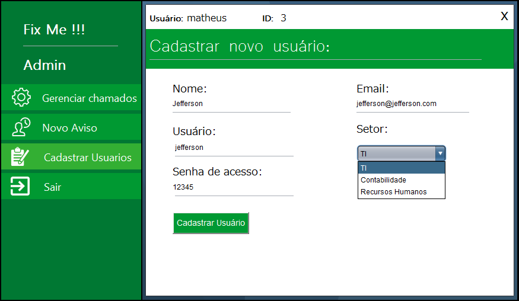

# Sistema gerenciador de incidentes

Projeto desenvolvido no 4º semestre do curso de Ciência da Computação para a disciplina de Tópicos Integradores I.

# Funcionamento:

O acesso ao sistema é separado entre usuários comuns e administradores, feito o login, é verificado qual é o acesso do usuário no banco e exibida a tela correspondente. Em todas as telas é exibido na parte superior, o nome e ID do usuário logado.

<figure>
	
	<figcaption>Figura 1 - Tela de Login</figcaption>
</figure>

## Interface de Usuário:

A interface de usuário tem 4 telas: 

* Novo Chamado
* Chamados
* Avisos
* Sair

### Novo chamado

Nesta tela é feito o cadastro de novos chamados. O usuário informa seus dados (Nome e email) e os detalhes do chamado (Categoria, sub-categoria, setor e descrição).

<figure>
	
	<figcaption>Figura 2 - Tela de Usuário - Novo Chamado</figcaption>
</figure>

### Chamados

Na guia chamados é exibida uma tabela com os dados: ID, assunto, data, hora, status e prazo de todos os chamados cadastrados no sistema.

É possível filtrar a exibição dos chamados por: 

1 - Todos os Chamados: Filtro padrão ao carregar a tela, que exibe todos os chamados cadastrados;  
2 - Seus Chamados: Exibe somente os chamados cadastrados pelo usuário logado;  
3 - Chamados concluídos: Exibe somente os chamados concluídos;  

Logo abaixo da tabela, um campo exibe a descrição do chamado selecionado, e ao lado um botão para encerrar o chamado

<figure>
	
	<figcaption>Figura 3 - Tela de Usuário - Chamados</figcaption>
</figure>

### Avisos

Na guia avisos é exibida uma tabela com ID, assunto, data e hora dos avisos cadastrados pelos administradores. Ao clicar em um aviso, é mostrada sua descrição no campo abaixo da tabela.

<figure>
	
	<figcaption>Figura 2 - Tela de Usuário - Avisos</figcaption>
</figure>

### Sair

Exibe uma caixa de diálogo perguntando se o usuário deseja realmente sair, caso positivo, encerra o sistema, caso negativo continua na guia atual.

## Interface de Administrador:

A interface de administrador tem 6 telas: 

* Gerenciar chamados, com 2 sub-telas:
  * Alterar Chamado
  * Concluir Chamado
* Novo Aviso
* Cadastrar Usuários
* Sair

### Gerenciar chamados

Na guia gerenciar chamados é exibida uma tabela com os dados: ID, categoria, data, urgência, impacto, prioridade e status de todos os chamados cadastrados no sistema.

Ao selecionar um chamado, exibe no campo abaixo sua descrição. 

Ao lado do campo com a descrição temos os botões "Alterar Chamado" e "Concluir Chamado", que direcionam para suas respectivas telas.

<figure>
	
	<figcaption>Figura 1 - Tela de Login</figcaption>
</figure>

### Alterar Chamado

Nesta guia o administrador seleciona a urgência, o impacto e o status do chamado.

Urgência e impacto são usados para definir a criticidade e o prazo de resolução do chamado.

Ao lado, são exibidas duas tabelas mostrando a relação entre essas definições.

<figure>
	
	<figcaption>Figura 1 - Tela de Login</figcaption>
</figure>

### Concluir Chamado

Nesta guia, o administrador conclui o chamado, informando por quem ele foi resolvido e qual foi a solução.

<figure>
	
	<figcaption>Figura 1 - Tela de Login</figcaption>
</figure>

### Novo Aviso

Nesta guia o administrador faz a inserção dos avisos que são mostrados na interface de usuário, informando o assunto e a descrição do aviso.

<figure>
	
	<figcaption>Figura 1 - Tela de Login</figcaption>
</figure>

### Cadastrar Usuários

Nesta guia o administrador faz o cadastro de novos usuários, informando os dados: Nome, email, usuario, senha de acesso e setor.

<figure>
	
	<figcaption>Figura 1 - Tela de Login</figcaption>
</figure>

### Sair

Exibe uma caixa de diálogo perguntando se o usuário deseja realmente sair, caso positivo, encerra o sistema, caso negativo continua na guia atual.

